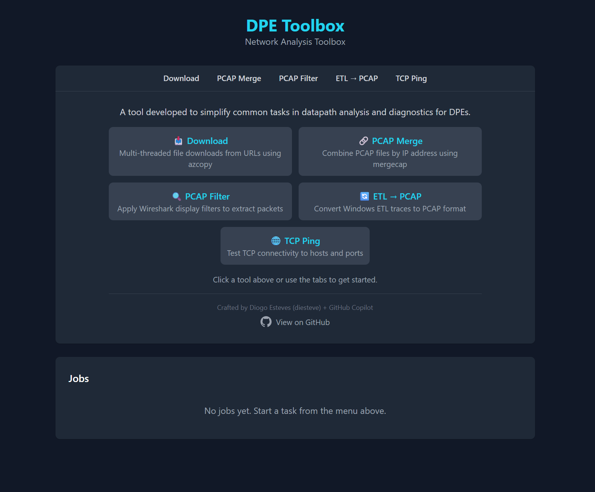

# DPE Toolbox

<p align="center">
  
  
  
</p>

A tool developed to simplify common tasks in datapath analysis and diagnostics for DPEs. Available as both a CLI and a Web UI, written in Rust.

## Features

| Command | Description | External Dependency |
|---------|-------------|---------------------|
| `download` | Multi-threaded file downloads from URL lists | azcopy (auto-downloads) |
| `merge` | Merge PCAP files (by IP or all into one) | Wireshark |
| `filter` | Filter PCAP files using Wireshark display filters | Wireshark |
| `summary` | Show PCAP file statistics and protocol hierarchy | Wireshark |
| `conversations` | List, filter, and export network flows from PCAPs | Wireshark |
| `toptalkers` | Show top endpoints ranked by traffic volume | Wireshark |
| `convert` | Convert Windows ETL traces to PCAP format | etl2pcapng (auto-downloads) |
| `subnet` | IPv4 subnet calculator | None |
| `tcpping` | TCP connectivity testing with continuous ping | None |
| `serve` | Launch Web UI for browser-based access | None |

## Web UI

Double-click the exe or run `dpetoolbox` to launch the Web UI at `http://localhost:3000`.

```powershell
# Launch on default port (opens browser automatically)
dpetoolbox

# Or specify a custom port
dpetoolbox serve --port 8080

# Launch interactive CLI mode instead
dpetoolbox --cli
```

The Web UI provides access to all tools through a browser interface with:
- Dark mode support (follows OS theme)
- Real-time job progress and detailed logging
- Run multiple jobs simultaneously
- Browse buttons for native file/folder selection
- Copy to clipboard and Save as .txt on job output
- In-app update notifications
- Works fully offline (all assets bundled)



## Installation

### Pre-built Binaries
Download the latest release from [Releases](https://github.com/daesteves/dpetoolbox/releases).

### Build from Source
```powershell
# Requires Rust toolchain
cargo build --release
```

The binary will be at `target/release/dpetoolbox.exe`

### Shell Completions (Optional)
Add tab completion to your PowerShell profile:
```powershell
dpetoolbox --completions powershell >> $PROFILE
```

## Quick Start

```powershell
# Launch Web UI (default when double-clicking the exe)
dpetoolbox

# Interactive CLI mode
dpetoolbox --cli

# Direct CLI usage
dpetoolbox download -f urls.txt
dpetoolbox tcpping -t google.com -p 443
dpetoolbox subnet 192.168.1.0/24
```

## Commands

### Download

Downloads files from a text file containing URLs (one per line). Uses azcopy for efficient multi-threaded downloads. Supports lines with arbitrary prefix text (e.g., `Ethernet19/1.4, https://...`).

```powershell
dpetoolbox download -f urls.txt
dpetoolbox download -f urls.txt -o C:\Downloads -t 8
dpetoolbox download --clipboard -o C:\Downloads
```

| Flag | Description | Default |
|------|-------------|---------|
| `-f, --file <FILE>` | Path to TXT file containing URLs | Required* |
| `--clipboard` | Read URLs from clipboard instead of file | - |
| `-o, --output <DIR>` | Output directory | `../<filename>/` |
| `-t, --threads <N>` | Number of parallel downloads | 4 |

*Either `--file` or `--clipboard` is required

---

### PCAP Merge

Merges PCAP files in a directory. If filenames match the `_X.X.X.X.pcap` pattern, files are grouped and merged per IP. Otherwise, all PCAP files are merged into a single `merged.pcap`.

```powershell
dpetoolbox merge -i ./pcaps
dpetoolbox merge -i ./pcaps -o ./merged
```

| Flag | Description | Default |
|------|-------------|---------|
| `-i, --input <DIR>` | Directory containing PCAP files | Required |
| `-o, --output <DIR>` | Output directory for merged files | Same as input |

Requires [Wireshark](https://www.wireshark.org/download.html) (uses `mergecap`).

---

### PCAP Filter

Filters PCAP files using Wireshark display filter syntax. Supports single file or entire directory.

```powershell
dpetoolbox filter -f capture.pcap -F "tcp.port == 443"
dpetoolbox filter -i ./pcaps -F "ip.src == 10.0.0.1"
dpetoolbox filter -i ./pcaps -F "tcp.port == 443" -d
```

| Flag | Description | Default |
|------|-------------|---------|
| `-f, --file <FILE>` | Single PCAP file to filter | - |
| `-i, --input <DIR>` | Directory containing PCAP files | - |
| `-o, --output <DIR>` | Output directory for filtered files | Same as input |
| `-F, --filter <EXPR>` | Wireshark display filter expression | Required |
| `-d, --delete-empty` | Delete output files with 0 matching packets | false |

VXLAN auto-decode on ports 65330, 65530, 10000, 20000. Requires [Wireshark](https://www.wireshark.org/download.html).

---

### PCAP Summary

Shows file statistics and protocol hierarchy for PCAP files using `capinfos` and `tshark`.

```powershell
dpetoolbox summary -f capture.pcap
dpetoolbox summary -i ./pcaps
```

| Flag | Description | Default |
|------|-------------|---------|
| `-f, --file <FILE>` | Single PCAP file to summarize | - |
| `-i, --input <DIR>` | Directory containing PCAP files | - |

Requires [Wireshark](https://www.wireshark.org/download.html).

---

### PCAP Conversations

Lists TCP, UDP, and IP conversations in a PCAP file with packet counts, byte totals, duration, and average speed. Supports filtering by IP address and port, and exporting individual flows to separate PCAP files.

```powershell
dpetoolbox conversations -f capture.pcap
dpetoolbox conversations -f capture.pcap --export 1
dpetoolbox conversations -f capture.pcap --export 3 -o ./flows
```

| Flag | Description | Default |
|------|-------------|---------|
| `-f, --file <FILE>` | PCAP file to analyze | Required |
| `-e, --export <N>` | Export conversation by index number | - |
| `-o, --output <DIR>` | Output directory for exported flow | Same as input |

Requires [Wireshark](https://www.wireshark.org/download.html).

---

### Top Talkers

Shows IP endpoints ranked by traffic volume with packet counts, byte totals, Tx/Rx breakdown, and average speed.

```powershell
dpetoolbox toptalkers -f capture.pcap
dpetoolbox toptalkers -f capture.pcap -n 20
```

| Flag | Description | Default |
|------|-------------|---------|
| `-f, --file <FILE>` | PCAP file to analyze | Required |
| `-n, --limit <N>` | Number of top talkers to show | 50 |

Requires [Wireshark](https://www.wireshark.org/download.html).

---

### ETL to PCAP Convert

Converts Windows ETL (Event Trace Log) files to PCAP format for analysis in Wireshark.

```powershell
dpetoolbox convert -i ./etls
dpetoolbox convert -i ./etls -o ./pcaps
```

| Flag | Description | Default |
|------|-------------|---------|
| `-i, --input <DIR>` | Directory containing ETL files | Required |
| `-o, --output <DIR>` | Output directory for PCAP files | Same as input |

Auto-downloads `etl2pcapng` if not found.

---

### IPv4 Subnet Calculator

Calculates network details for any IPv4 subnet. No external dependencies.

```powershell
dpetoolbox subnet 192.168.1.0/24
dpetoolbox subnet 10.0.0.0/8
```

Output includes: network/broadcast addresses, subnet and wildcard masks, host count and range, IP class (A-E), type (private/public/loopback), and binary representations.

---

### TCP Ping

Tests TCP connectivity to a host and port with continuous ping.

```powershell
dpetoolbox tcpping -t google.com -p 443
dpetoolbox tcpping -t 10.0.0.1 -p 22 --timeout 5000 --interval 2
```

| Flag | Description | Default |
|------|-------------|---------|
| `-t, --target <HOST>` | Target hostname or IP address | Required |
| `-p, --port <PORT>` | Target port number | Required |
| `--timeout <MS>` | Connection timeout in milliseconds | 2000 |
| `--interval <SECS>` | Interval between pings in seconds | 1 |

No external dependencies (pure Rust).

---

## Interactive CLI Mode

Run `dpetoolbox --cli` to enter interactive mode with a menu:

```
   _____  _____  ______   _______          _ _
  |  __ \|  __ \|  ____| |__   __|        | | |
  | |  | | |__) | |__       | | ___   ___ | | |__   _____  __
  | |  | |  ___/|  __|      | |/ _ \ / _ \| | '_ \ / _ \ \/ /
  | |__| | |    | |____     | | (_) | (_) | | |_) | (_) >  <
  |_____/|_|    |______|    |_|\___/ \___/|_|_.__/ \___/_/\_\

         by Diogo Esteves

Select an option:

> Download files from URL list
  Merge PCAP files
  Filter PCAP files
  Convert ETL to PCAP
  PCAP Summary
  PCAP Conversations
  PCAP Top Talkers
  IPv4 Subnet Calculator
  TCP Ping
  Exit
```

---

## Requirements

### System Requirements
- Windows 10/11 (x64)

### External Dependencies

| Tool | Required For | Auto-Download |
|------|--------------|---------------|
| azcopy | `download` command | Yes |
| etl2pcapng | `convert` command | Yes |
| Wireshark | `merge`, `filter`, `summary`, `conversations`, `toptalkers` | Manual install |

Auto-downloaded tools are stored in `%LOCALAPPDATA%\dpetoolbox\`

### Installing Wireshark

1. Download from https://www.wireshark.org/download.html
2. During installation, ensure **TShark** component is selected
3. Default installation path is expected: `C:\Program Files\Wireshark\`

---

## License

MIT License - see [LICENSE](LICENSE) for details.

## Author

**Diogo Esteves** + GitHub Copilot
